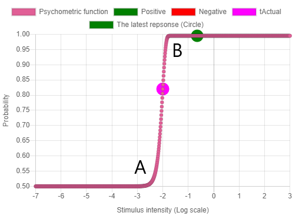

# jsQUEST: A Bayesian adaptive psychometric method for measuring thresholds in online experiments.

Using adaptive psychometric procedures, the experimenter can determine thresholds efficiently by determining the stimulus intensity based on the stimuli and the observer’s responses in the preceding trials. [Watson and Pelli (1983)](https://link.springer.com/article/10.3758%2FBF03202828) reported QUEST which uses a Bayesian method to estimate the position of the psychometric function. jsQUEST is a translation of the MATLAB-based QUEST into JavaScript for online experiments. The source code is available on [GitHub](https://github.com/kurokida/jsQUEST).

If you are more interested in [QUEST+ (Watson, 2017)](https://jov.arvojournals.org/article.aspx?articleid=2611972) than QUEST, then you can use [jsQuestPlus](https://github.com/kurokida/jsQuestPlus) instead.

# A psychometric function assuming the Weibull distribution. 

Figure 1 shows a psychophysical function which assumes a Weibull distribution. You can also see this graph in [the demo](https://www.hes.kyushu-u.ac.jp/~kurokid/QUEST/jsPsychDemo/jsQUEST_jsPsychDemo.html). 



*Figure 1. A psychophysical function assuming a Weibull distribution.*

This graph has been drawn using the following default values:

- The actual (true) threshold you want to know: tActual (Default: -2)
- Your guess about the threshold: tGuess (Default: -1)
- Your guess about the standard deviation of the threshold: tGuessSd (Default: 2)
- Threshold criterion expressed as probability: pThreshold (Default: 0.82)
- The parameters of a Weibull psychometric function: Beta (Default: 3.5). The slope of the psychometric function.
- The parameters of a Weibull psychometric function: Delta (Default: 0.01). The probability of making mistakes by participants at intensities significantly greater than the threshold.
- The parameters of a Weibull psychometric function: Gamma (Default: 0.5). The probability of a success (a response of YES) at zero intensity.

The pink circle represents the actual threshold (tActual). The experimenter does not usually know the value, and wants to know it by conducting the experiment. The tActual is used only for simulation, and is not necessarily required to run QUEST. 

The tGuess determines the horizontal position of the psychometric function, while the Beta, Delta, and Gamma determines the shape of the psychometric function. The tGuessSd affects the probability density function (PDF) of thresholds.

The probability of correct/YES answers is about 0.5 at (A) the x-axis of -2.5, and is about 1.0 at (B) the x-axis of -1.5. The intensity of (B) is 10 times larger than that of (A) because the x-axis is the log scale. By using the default values (Beta = 3.5, Delta = 0.01, Gamma = 0.5), the experimenter is assuming such a psychophysical function.

# Stimulus intensity

Before beggining an experiment, the experimenter needs to determine the stimulus intensity. For example, it could be the luminance, color, size, length, spatial/temporal frequency, or number of dots. The experimenter is free to determine the intensity of the stimulus as long as it is considered to fit the psychophysical function.

# Threshold criterion expressed as probability (pThreshold)

Specify the probability that the experimenter is interested in. It is conventionally 75% for the two-alternative forced choice task, and 50% for the yes/no task. The default is 82%.

# Guess the threshold (tGuess)

Estimate of the stimulus intensity that is expected to result in a response rate of pThreshold. The default is -1. Given that the x-axis is the log scale, the default means 10^(-1) = 0.1. The units are arbitrary. The symbol "^" means a power in this document.

# Installation

Write the following line in the head section.

```html
<script src="https://www.hes.kyushu-u.ac.jp/~kurokid/QUEST/dist/jsQUEST.js"></script>
```

Or download the dist/jsQUEST.js file from [the repository](https://github.com/kurokida/jsQUEST) and include it using a script tag.

If you want to use jsQUEST as an ES6 module, please refer to [the README](https://github.com/kurokida/jsQUEST).

# How to use jsQUEST

The usage of jsQUEST is the same as QUEST distributed as a part of Psychtoolbox. So, you can refer to [the help of Psychtoolbox](http://psychtoolbox.org/docs/Quest). Note the prefix "jsQUEST".

At first, call the QuestCreate function like this.

```javascript 
myquest = jsQUEST.QuestCreate(tGuess, tGuessSd, pThreshold, beta, delta, gamma);
```

The QuestQuantile function returns a suggestion of stimulus intensity for the next trial. You can use the QuestMean or QuestMode functions instead of the QuestQuantile.

```javascript 
tTest = jsQUEST.QuestQuantile(myquest);	
```

If the default values are used, the first call of the QuestQuantile function returns -0.65. Note that the difference between the returned value, -0.65, and tGuess, -1, is 0.35. The QuestQuantile proposes to present a stimulus with 10^0.35 = 2.24 times the intensity of the tGuess for the first trial. As long as the same Beta, Delta, and Gamma are used the difference between the first returned value and tGuess will be about 0.35, no matter what the value of tGuess is.

The QUEST method is easy to understand when the intensity of the stimulus is on a log scale, e.g. dB, while in other cases I recommend to think of it as follows. For example, if the experimenter predicts that the stimulus intensity of 150 pixels will result in a response rate of pThreshold, 0.82, then tGuess should be log10(150) = 2.18. If the default values regarding Beta, Delta, and Gamma are used, the first call of QuestQuantile returns 2.53. Note that the difference between the returned value, 2.18, and tGuess, 2.53, is 0.35. This is the same as when tGuess is -1. The QuestQuantile proposes to present a stimulus with 10^0.35 = 2.24 times the intensity of tGuess. The intensity can be calculated in one of the two ways: (a) 150 * 2.24, or (b) 10 ^ 2.53. The results of the two formulas are almost identical (about 338 pixels).

## Update the PDF

```javascript
myquest = jsQUEST.QuestUpdate(myquest, tTest, response); 
// % Add the new datum (actual test intensity and observer response) to the database.
```

Update the PDF of thresholds by specifing the current stimulus intensity (tTest) and the response (YES/SUCCESS = 1 or NO/FAILURE = 0). The tTest is not necessarily the value suggested by QUEST. For example, there may be upper and lower limits of the stimulus intensity. If QUEST proposes a value that exceeds these limits, it can be changed to an appropriate value. The important thing is to update the PDF with the actual stimulus intensity (tTest) and the response.

## Termination rules

Watson and Pelli (1983) recommended to stop updating (a) when a confidence interval for the location of threshold is smaller than a specified size, or (b) after a fixed number of trials. Pelli's demo program (QuestDemo.m) updates the PDF 40 times.

## Estimate of the threshold

Finally, the experimenter can estimate the threshold and its standard deviation in the following way:

```javascript
const threshold = jsQUEST.QuestMean(myquest); // % Recommended by Pelli (1989) and King-Smith et al. (1994). 
const sd = jsQUEST.QuestSd(myquest);
```

# Functions

These are the links to the help of original MATLAB version of QUEST. 

- [QuestCreate](http://psychtoolbox.org/docs/QuestCreate)
- [QuestUpdate](http://psychtoolbox.org/docs/QuestUpdate)
- [QuestMean](http://psychtoolbox.org/docs/QuestMean)
- [QuestMode](http://psychtoolbox.org/docs/QuestMode)
- [QuestQuantile](http://psychtoolbox.org/docs/QuestQuantile)
- [QuestSd](http://psychtoolbox.org/docs/QuestSd)
- [QuestBetaAnalysis](http://psychtoolbox.org/docs/QuestBetaAnalysis)
- [QuestP](http://psychtoolbox.org/docs/QuestP)
- [QuestPdf](http://psychtoolbox.org/docs/QuestPdf)
- [QuestRecompute](http://psychtoolbox.org/docs/QuestRecompute)
- [QuestSimulate](http://psychtoolbox.org/docs/QuestSimulate)
- [QuestTrials](http://psychtoolbox.org/docs/QuestTrials)

The usage of jsQUEST is the same as that of the original QUEST except for the following points:

- QuestBetaAnalysis does not support outputting to a file.
- QuestMode returns an object with the 'mode' and 'pdf' properties.
- QuestRecompute takes the third and fourth arguments. The third argument means the width of the chart, and the forth argument means the height of the chart.
- QuestSimulate takes the fifth and sixth arguments. The fifth argument means the width of the chart, and the sixth argument means the height of the chart.

# References

- [King-Smith, P. E., Grigsby, S. S., Vingrys, A. J., Benes, S. C., & Supowit, A. (1994). Efficient and unbiased modifications of the QUEST threshold method: Theory, simulations, experimental evaluation and practical implementation. Vision Research, 34, 885–912. ](https://doi.org/10.1016/0042-6989(94)90039-6)
- [Watson, A. B. (2017). QUEST+: A general multidimensional Bayesian adaptive psychometric method. Journal of Vision 17.](https://doi.org/10.1167/17.3.10)
- [Watson, A. B., & Pelli, D. G. (1983). Quest: A Bayesian adaptive psychometric method. Perception & Psychophysics, 33. ](https://doi.org/10.3758/BF03202828)
